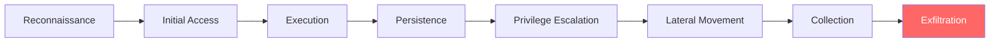
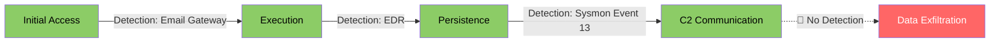
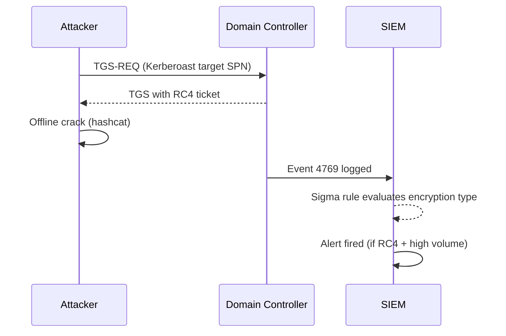
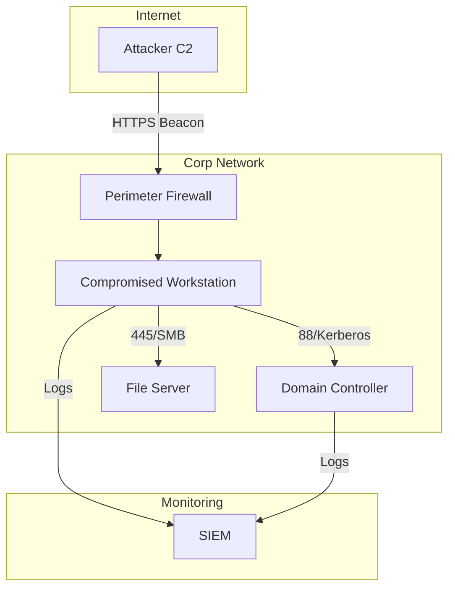
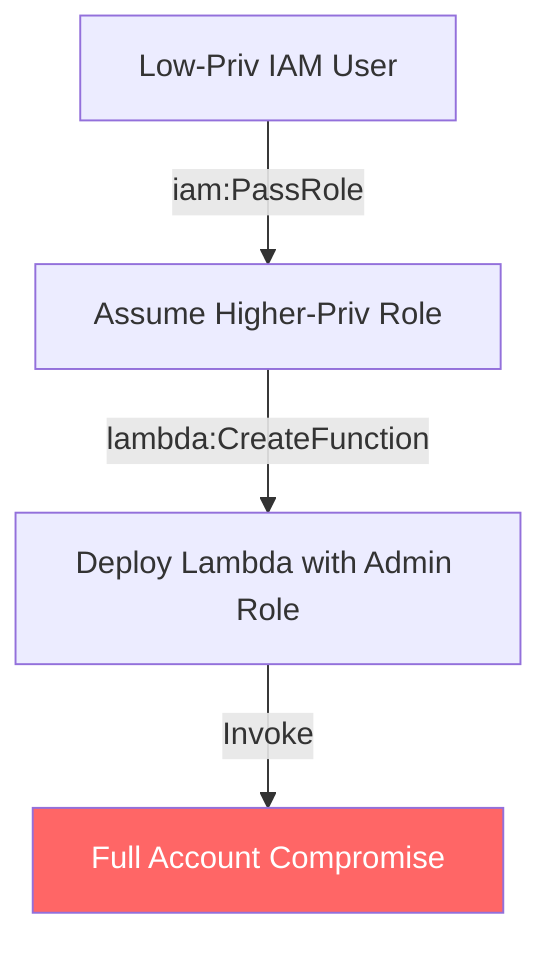
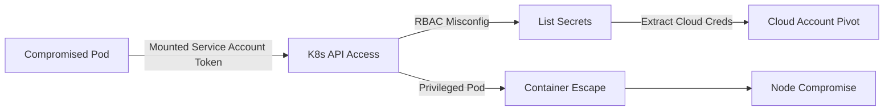
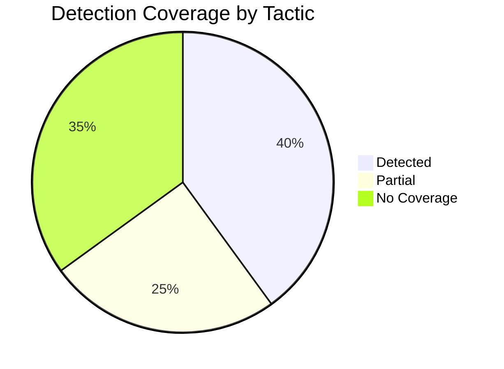
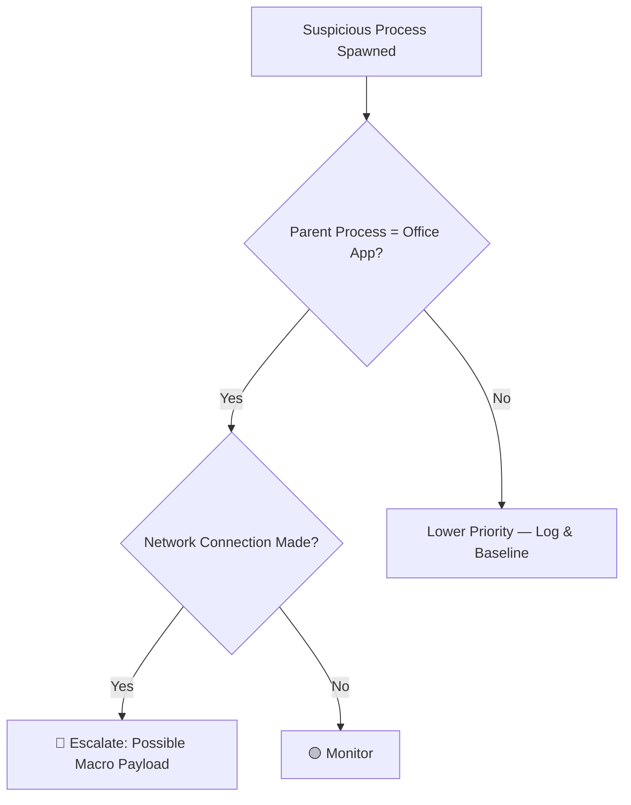
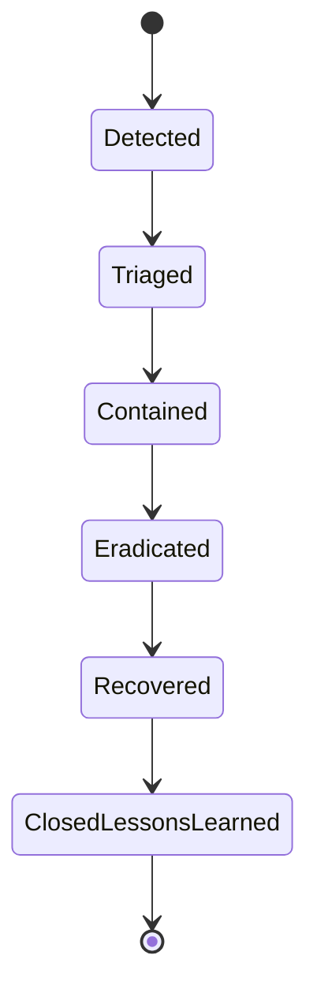

# Mermaid Diagram Guide

Copy-paste starter diagrams for TTP docs, labs, and incident reports. All of these render natively in GitHub Markdown — no plugins required.

## 1. Attack Chain (Flowchart)



## 2. Kill Chain with Detection Points



## 3. Sequence Diagram (Auth / Protocol Abuse)



## 4. Network / Infrastructure Diagram



## 5. Cloud IAM Privilege Escalation Path (AWS/Azure)



## 6. Kubernetes Attack Path



## 7. Incident Timeline

```mermaid
timeline
    title Example Incident Timeline
    09:00 : Phishing email delivered
    09:12 : User clicks malicious link
    09:15 : Payload executes : Beacon established
    11:40 : Lateral movement detected by EDR
    11:55 : SOC begins triage
    12:30 : Host isolated
```

## 8. ATT&CK Coverage (Pie Chart)



## 9. Decision Tree (Threat Hunting Triage)



## 10. State Diagram (Incident Lifecycle)



---

### Tips

- Keep diagrams under ~15 nodes for readability on GitHub's mobile renderer.
- Use `style` / `classDef` sparingly — red for gaps/critical paths, green for validated detections.
- Prefer `flowchart LR` for attack chains (reads left-to-right like a timeline) and `flowchart TD` for hierarchical/privilege structures.
