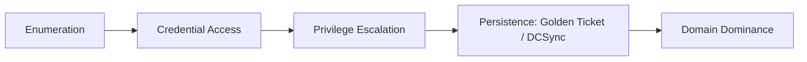

# Active Directory

On-prem identity and access — the backbone of most enterprise networks, and the most common lateral-movement target.

## Sub-Topics

- Enumeration (BloodHound, LDAP, `net`/PowerView)
- Kerberos abuse (Kerberoasting, AS-REP Roasting, Golden/Silver Tickets)
- ACL & delegation abuse (DACL abuse, unconstrained/constrained delegation)
- Credential theft (DCSync, NTDS.dit extraction, LSASS dumping)
- Group Policy abuse
- Trust relationship abuse (cross-domain, cross-forest)

## Attack Flow Overview

## ATT&CK Coverage

| Technique ID | Name | Doc | Status |
|---|---|---|---|
| T1558.003 | Kerberoasting | `ttps/kerberoasting.md` | 🔲 TODO |
| T1003.006 | DCSync | `ttps/dcsync.md` | 🔲 TODO |
| T1558.001 | Golden Ticket | `ttps/golden-ticket.md` | 🔲 TODO |
| T1482 | Domain Trust Discovery | `ttps/trust-enumeration.md` | 🔲 TODO |

> Use [`templates/attack-detection-template.md`](../../templates/attack-detection-template.md) for each entry above.

## Folders

- `ttps/` — individual technique writeups
- `labs/` — AD lab builds (e.g. GOAD, DetectionLab)
- `references/` — LDAP filters, PowerView/BloodHound cheatsheets
