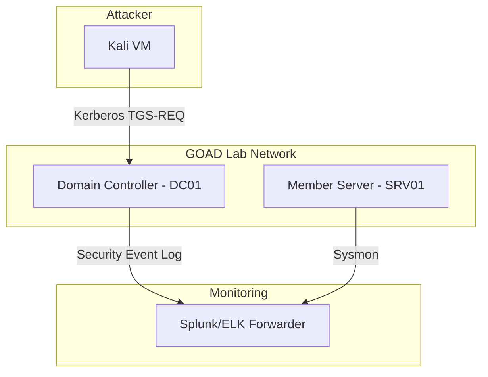

# Lab: Kerberoasting Detection Lab (GOAD-based)

| Field | Value |
|---|---|
| **Objective** | Reproduce Kerberoasting and validate Sigma/KQL detection |
| **Domain** | Active Directory |
| **Difficulty** | Intermediate |
| **Est. Build Time** | 60 min |
| **Cost** | Free (local Vagrant/VirtualBox) |

## Objective

Stand up a small vulnerable AD environment (using [GOAD](https://github.com/Orange-Cyberdefense/GOAD)) with an SPN-registered service account, execute a Kerberoasting attack, and confirm the [Kerberoasting detection rule](../ttps/kerberoasting.md) fires correctly.

## Architecture



## Tools Required

| Tool | Purpose | Link |
|---|---|---|
| Vagrant + VirtualBox | Lab provisioning | https://www.vagrantup.com |
| GOAD | Vulnerable AD environment | https://github.com/Orange-Cyberdefense/GOAD |
| impacket | Attack execution | https://github.com/fortra/impacket |
| Splunk Free / ELK | Log analysis & detection testing | |

## Build Steps

> ⚠️ Isolated lab network only.

1. Clone and provision GOAD:
   ```bash
   git clone https://github.com/Orange-Cyberdefense/GOAD.git
   cd GOAD && ./goad.sh -p virtualbox -t local
   ```
2. Install a Splunk/Sysmon forwarder on the DC and forward Security logs to your SIEM.
3. Create a test service account with an SPN set (`setspn -A HTTP/svc01 goad\svc_web`).
4. Verify attacker VM has network reachability to DC01 on port 88.

## Attack Scenario Walkthrough

1. From the attacker VM, run the [Kerberoasting technique](../ttps/kerberoasting.md) steps against `svc_web`.
2. Confirm Event ID 4769 with `TicketEncryptionType 0x17` appears in the SIEM.
3. Load the Sigma rule from the technique doc and confirm it fires.

## Validation Checklist

- [ ] Attack technique executed successfully
- [ ] Event 4769 logged with RC4 encryption type
- [ ] Sigma/KQL rule fired an alert
- [ ] False positive check against normal legacy-app SPN traffic

## Teardown

```bash
./goad.sh -p virtualbox -t local --destroy
```

- [ ] All VMs destroyed
- [ ] Splunk forwarder config removed
- [ ] Test service account deleted

## Notes & Gotchas

GOAD's default build can take 45+ minutes on first run due to Windows updates inside the VMs — pre-download ISOs to speed this up.
