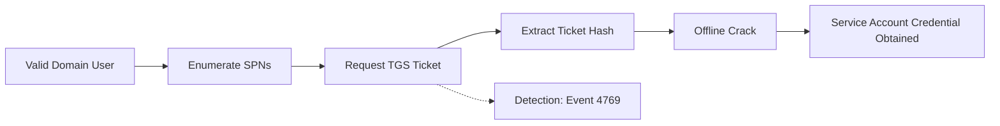

# Kerberoasting

| Field | Value |
|---|---|
| **MITRE ATT&CK ID** | T1558.003 |
| **Tactic** | Credential Access |
| **Platform** | Active Directory |
| **Severity** | High |
| **Status** | 🟡 Partial Coverage |
| **Author** | @example |
| **Last Reviewed** | 2026-07-18 |

## Summary

Kerberoasting abuses the Kerberos service ticket (TGS) request process to obtain crackable password hashes for service accounts, which often hold elevated privileges and weak, never-rotated passwords.

## Prerequisites

- Any valid domain user account (no elevated privileges required)
- Network line-of-sight to a Domain Controller (port 88/tcp)
- Tooling: Rubeus, impacket's `GetUserSPNs.py`, or PowerView

## Attack Simulation Steps

> ⚠️ Lab environment only.

1. Enumerate accounts with Service Principal Names (SPNs) set:
   ```bash
   GetUserSPNs.py DOMAIN/user:password -dc-ip <dc-ip> -request
   ```
2. Request TGS tickets for each SPN account — this is logged as Event ID 4769.
3. Crack the extracted ticket offline:
   ```bash
   hashcat -m 13100 hashes.txt rockyou.txt
   ```

## Attack Flow



## Detection Logic

### Data Sources Required

| Source | Log/Event | Notes |
|---|---|---|
| Windows Security Log | 4769 | Kerberos service ticket request |

### Detection Rule (Sigma)

```yaml
title: Kerberoasting via RC4 Ticket Encryption
id: 3c8b8b9a-0000-4000-8000-000000000001
status: experimental
logsource:
  product: windows
  service: security
detection:
  selection:
    EventID: 4769
    TicketEncryptionType: '0x17'
  filter:
    ServiceName|endswith: '$'
  condition: selection and not filter
level: medium
```

### Detection Rule (KQL)

```kql
SecurityEvent
| where EventID == 4769
| where TicketEncryptionType == "0x17"
| where ServiceName !endswith "$"
| summarize RequestCount = count() by Account, bin(TimeGenerated, 10m)
| where RequestCount > 5
```

## False Positive Considerations

- Legacy applications that only support RC4 encryption will trigger this rule benignly — maintain an allowlist of known legacy SPNs.
- Bulk scheduled jobs authenticating to many services can look similar to enumeration; correlate with source host reputation.

## Response Actions

1. Rotate the password of any account whose SPN was targeted, using a long random passphrase.
2. Move service accounts to `gMSA` (Group Managed Service Accounts) where possible.
3. Investigate the requesting account for further compromise indicators.

## References

- [MITRE ATT&CK — T1558.003](https://attack.mitre.org/techniques/T1558/003/)
- [Impacket GetUserSPNs](https://github.com/fortra/impacket)
