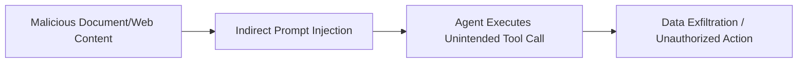

# AI Security

Emerging attack surface introduced by LLMs, RAG pipelines, and AI agents/tooling.

## Sub-Topics

- Prompt injection (direct & indirect)
- Model / training data exfiltration
- RAG pipeline poisoning
- Insecure tool/agent invocation (excessive agency)
- Jailbreaking & guardrail bypass
- Supply chain risks (model weights, third-party plugins/MCP servers)

## Attack Flow Overview

## ATT&CK Coverage

*(Mapped against [MITRE ATLAS](https://atlas.mitre.org/) — the ATT&CK-style matrix for AI systems)*

| ATLAS ID | Name | Doc | Status |
|---|---|---|---|
| AML.T0051 | LLM Prompt Injection | `ttps/prompt-injection.md` | 🔲 TODO |
| AML.T0024 | Exfiltration via ML Inference API | `ttps/model-exfiltration.md` | 🔲 TODO |
| AML.T0070 | RAG Poisoning | `ttps/rag-poisoning.md` | 🔲 TODO |

## Folders

- `ttps/` — technique writeups
- `labs/` — sandboxed LLM app / agent test harnesses
- `references/` — guardrail testing checklists, MCP tool-permission review notes
