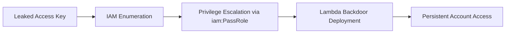

# AWS

IAM, storage, compute, and serverless abuse across AWS accounts.

## Sub-Topics

- IAM enumeration and privilege escalation paths (Pacu, CloudFox)
- S3 bucket exposure and exfiltration
- Lambda persistence and abuse
- EC2 metadata service (IMDS) credential theft
- CloudTrail evasion
- Cross-account role assumption abuse

## Attack Flow Overview

## ATT&CK Coverage

| Technique ID | Name | Doc | Status |
|---|---|---|---|
| T1078.004 | Valid Accounts: Cloud Accounts | `ttps/valid-cloud-accounts.md` | 🔲 TODO |
| T1552.005 | Cloud Instance Metadata API | `ttps/imds-credential-theft.md` | 🔲 TODO |
| T1098.001 | Additional Cloud Credentials | `ttps/iam-persistence.md` | 🔲 TODO |

## Folders

- `ttps/` — technique writeups
- `labs/` — CloudGoat / sandbox account builds
- `references/` — IAM policy cheatsheets, CLI one-liners
