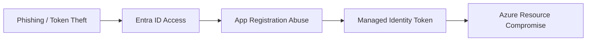

# Azure / Entra ID

Cloud identity and Azure resource abuse, including hybrid AD-to-cloud attack paths.

## Sub-Topics

- Entra ID (Azure AD) enumeration and abuse (AzureHound)
- Conditional Access policy bypass
- App registration / service principal abuse
- Managed identity token theft
- Azure Storage / Key Vault exposure
- Hybrid identity attacks (AD Connect, PTA, seamless SSO)

## Attack Flow Overview

## ATT&CK Coverage

| Technique ID | Name | Doc | Status |
|---|---|---|---|
| T1078.004 | Valid Accounts: Cloud Accounts | `ttps/valid-cloud-accounts.md` | 🔲 TODO |
| T1550.001 | Application Access Token Abuse | `ttps/app-token-abuse.md` | 🔲 TODO |
| T1526 | Cloud Service Discovery | `ttps/cloud-service-discovery.md` | 🔲 TODO |

## Folders

- `ttps/` — technique writeups
- `labs/` — sandbox tenant builds
- `references/` — Az CLI / Graph API cheatsheets
