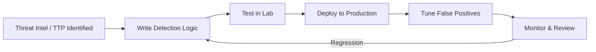

# Detection Engineering

Cross-domain detection content: rule libraries, engineering process, and tuning notes. This is where detections referenced from other domains' TTP docs can be centralized/indexed.

## Sub-Topics

- Sigma rule library & conventions
- KQL (Microsoft Sentinel/Defender) rule library
- SPL (Splunk) rule library
- Detection-as-code pipelines (CI/CD for rules)
- Alert tuning & false-positive management
- Detection maturity model (log-only → alerting → automated response)

## Detection Engineering Lifecycle

## Rule Index

| Rule Name | Format | Maps To | Location |
|---|---|---|---|
| Kerberoasting Detection | Sigma | T1558.003 | `../active-directory/ttps/kerberoasting.md` |
| IMDS Credential Theft | KQL | T1552.005 | `../aws/ttps/imds-credential-theft.md` |

> New detections should live alongside the attack they detect (in the domain's `ttps/` folder) using [`templates/attack-detection-template.md`](../../templates/attack-detection-template.md). This README indexes them for cross-domain lookup.

## Folders

- `ttps/` — general/cross-cutting detection techniques not tied to one domain
- `labs/` — SIEM/log pipeline lab builds
- `references/` — Sigma rule spec cheatsheet, KQL/SPL syntax reference
