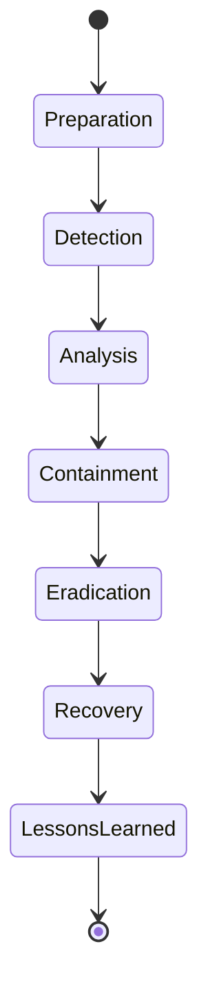

# DFIR (Digital Forensics & Incident Response)

Forensic artifact references, triage playbooks, and incident response process documentation.

## Sub-Topics

- Windows forensic artifacts (Prefetch, Amcache, ShimCache, Event Logs)
- Linux forensic artifacts (bash history, auth logs, systemd journal)
- Memory forensics (Volatility workflows)
- Disk/timeline analysis (Plaso, Autopsy)
- Incident response process (NIST SP 800-61 phases)
- Chain of custody & evidence handling

## Incident Response Lifecycle

## Playbook Index

| Scenario | Doc | Status |
|---|---|---|
| Ransomware Triage | `ttps/ransomware-triage-playbook.md` | 🔲 TODO |
| Business Email Compromise | `ttps/bec-triage-playbook.md` | 🔲 TODO |
| Insider Threat Investigation | `ttps/insider-threat-playbook.md` | 🔲 TODO |

> Use [`templates/lessons-learned-template.md`](../../templates/lessons-learned-template.md) for closed incidents — redact all sensitive identifiers before committing.

## Folders

- `ttps/` — triage/investigation playbooks
- `labs/` — forensic image analysis labs
- `references/` — artifact location cheatsheets, Volatility plugin reference
