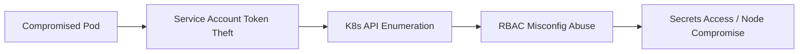

# Kubernetes

Container orchestration attack surface: cluster misconfig, RBAC abuse, and node/pod escape.

## Sub-Topics

- RBAC enumeration & abuse
- Pod escape & privileged container abuse
- Secrets exfiltration (etcd, mounted secrets)
- Service account token abuse
- Supply chain (malicious images, admission controller bypass)
- Network policy gaps / lateral movement between pods

## Attack Flow Overview

## ATT&CK Coverage

*(Mapped against the [ATT&CK for Containers](https://attack.mitre.org/matrices/enterprise/containers/) matrix)*

| Technique ID | Name | Doc | Status |
|---|---|---|---|
| T1610 | Deploy Container | `ttps/malicious-container-deploy.md` | 🔲 TODO |
| T1552.007 | Container API | `ttps/service-account-token-theft.md` | 🔲 TODO |
| T1611 | Escape to Host | `ttps/pod-escape.md` | 🔲 TODO |

## Folders

- `ttps/` — technique writeups
- `labs/` — kind/minikube vulnerable cluster builds
- `references/` — kubectl/RBAC audit cheatsheet
