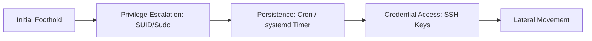

# Linux

Server and endpoint attacker tradecraft on Linux systems.

## Sub-Topics

- Privilege escalation (SUID abuse, sudo misconfig, kernel exploits)
- Persistence (cron, systemd, .bashrc, SSH keys)
- Credential access (`/etc/shadow`, SSH agent hijacking)
- Rootkits & LD_PRELOAD abuse
- Container/host boundary abuse (see also Kubernetes domain)
- Log tampering & defense evasion

## Attack Flow Overview

## ATT&CK Coverage

| Technique ID | Name | Doc | Status |
|---|---|---|---|
| T1548.001 | Setuid/Setgid Abuse | `ttps/suid-privesc.md` | 🔲 TODO |
| T1053.003 | Cron Persistence | `ttps/cron-persistence.md` | 🔲 TODO |
| T1552.004 | Private Keys | `ttps/ssh-key-theft.md` | 🔲 TODO |

## Folders

- `ttps/` — technique writeups
- `labs/` — vulnerable VM builds
- `references/` — auditd rules, common privesc checklist
