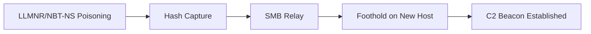

# Network

Protocol-level and infrastructure attacker tradecraft: C2 channels, pivoting, and traffic analysis.

## Sub-Topics

- C2 traffic patterns (HTTP(S), DNS, ICMP tunneling)
- Protocol abuse (SMB relay, LLMNR/NBT-NS poisoning, ARP spoofing)
- Pivoting & tunneling (SOCKS proxies, port forwarding)
- Network segmentation bypass
- Traffic analysis & signature detection (Zeek, Suricata)

## Attack Flow Overview

## ATT&CK Coverage

| Technique ID | Name | Doc | Status |
|---|---|---|---|
| T1557.001 | LLMNR/NBT-NS Poisoning & SMB Relay | `ttps/llmnr-poisoning-relay.md` | 🔲 TODO |
| T1572 | Protocol Tunneling | `ttps/protocol-tunneling.md` | 🔲 TODO |
| T1090 | Proxy / Pivoting | `ttps/pivoting-socks-proxy.md` | 🔲 TODO |

## Folders

- `ttps/` — technique writeups
- `labs/` — Zeek/Suricata detection labs
- `references/` — Wireshark filters, Zeek log field cheatsheet
