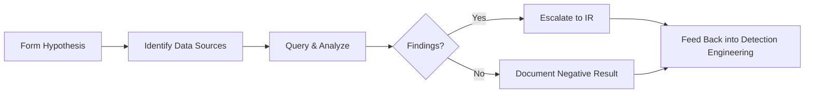

# Threat Hunting

Hypothesis-driven, proactive hunts that don't rely on a pre-existing alert.

## Sub-Topics

- Hunt methodology (hypothesis → data → analysis → findings)
- Behavioral hunting (LOLBins, unusual parent-child process chains)
- Threat intel-driven hunting (IOC/TTP sweeps from CTI reports)
- Baseline development & anomaly detection
- Hunt package documentation & repeatability

## Hunt Process

## Hunt Package Index

| Hunt Name | Hypothesis | Doc | Status |
|---|---|---|---|
| Unusual LSASS Access | Non-standard processes reading LSASS memory | `ttps/lsass-access-hunt.md` | 🔲 TODO |
| Rare Parent-Child Process Chains | Office apps spawning shells | `ttps/office-shell-spawn-hunt.md` | 🔲 TODO |

> Use [`templates/attack-detection-template.md`](../../templates/attack-detection-template.md) as a base — hunts often graduate into standing detections.

## Folders

- `ttps/` — individual hunt packages
- `labs/` — hunt-testing environments with seeded malicious activity
- `references/` — hunting query cheatsheet (KQL/SPL/Sigma-to-query conversions)
