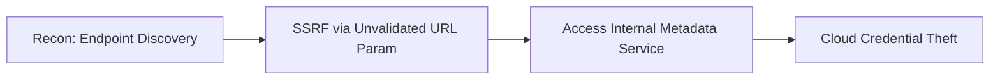

# Web Security

Application-layer vulnerabilities and attacker tradecraft, aligned to the OWASP Top 10.

## Sub-Topics

- Injection (SQLi, command injection, SSTI)
- Broken authentication & session management
- Server-Side Request Forgery (SSRF)
- Broken access control (IDOR, privilege escalation)
- XXE / deserialization
- Business logic abuse

## Attack Flow Overview

## ATT&CK / OWASP Coverage

| OWASP ID | Name | Doc | Status |
|---|---|---|---|
| A03:2021 | Injection | `ttps/sql-injection.md` | 🔲 TODO |
| A10:2021 | SSRF | `ttps/ssrf.md` | 🔲 TODO |
| A01:2021 | Broken Access Control (IDOR) | `ttps/idor.md` | 🔲 TODO |

## Folders

- `ttps/` — technique writeups
- `labs/` — DVWA/juice-shop style lab builds
- `references/` — Burp Suite workflow cheatsheet, payload lists (linked, not embedded)
