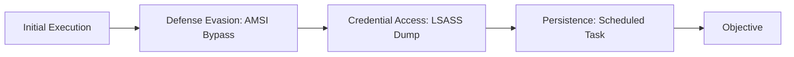

# Windows

Endpoint-level attacker tradecraft on Windows hosts, independent of Active Directory.

## Sub-Topics

- Living-off-the-land binaries (LOLBins/LOLBAS)
- Process injection & hollowing
- Persistence (Run keys, scheduled tasks, services, WMI)
- Credential access (LSASS dumping, SAM/DPAPI)
- Defense evasion (AMSI bypass, ETW patching)
- PowerShell abuse & logging bypass

## Attack Flow Overview

## ATT&CK Coverage

| Technique ID | Name | Doc | Status |
|---|---|---|---|
| T1055 | Process Injection | `ttps/process-injection.md` | 🔲 TODO |
| T1003.001 | LSASS Memory | `ttps/lsass-dumping.md` | 🔲 TODO |
| T1053.005 | Scheduled Task | `ttps/scheduled-task-persistence.md` | 🔲 TODO |
| T1562.001 | Disable/Modify AV/EDR | `ttps/amsi-bypass.md` | 🔲 TODO |

## Folders

- `ttps/` — technique writeups
- `labs/` — Sysmon + Windows VM detection labs
- `references/` — Sysmon config, event ID cheatsheet
