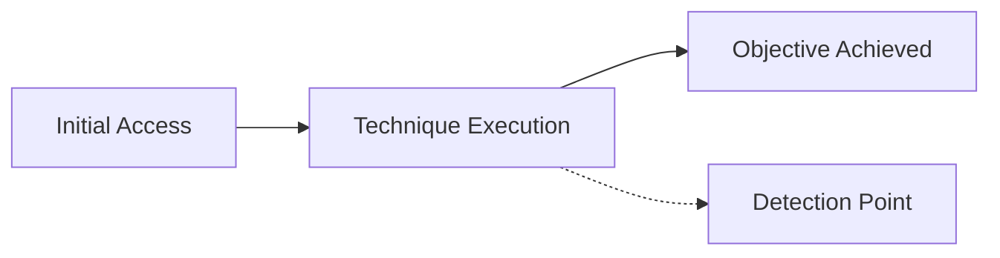

<!--
TEMPLATE: Attack + Detection
Copy this file into domains/<domain>/ttps/<technique-name>.md and fill in every section.
-->

# <Technique Name>

| Field | Value |
|---|---|
| **MITRE ATT&CK ID** | TXXXX.XXX |
| **Tactic** | e.g. Credential Access |
| **Platform** | e.g. Windows / AD / Azure / AWS / Linux |
| **Severity** | Low / Medium / High / Critical |
| **Status** | 🟢 Detected · 🟡 Partial Coverage · 🔴 No Coverage |
| **Author** | @your-handle |
| **Last Reviewed** | YYYY-MM-DD |

## Summary

One or two sentences describing what this technique achieves and why an adversary would use it.

## Prerequisites

- Access level / conditions required for the attack (e.g. valid domain user, network access to DC on 88/tcp)
- Tools required (e.g. Rubeus, impacket, AzureHound)

## Attack Simulation Steps

> ⚠️ Lab environment only. Do not run against production systems without authorization.

1. Step one — command or action
   ```bash
   example-command --flag value
   ```
2. Step two
3. Step three

## Attack Flow



## Detection Logic

### Data Sources Required

| Source | Log/Event | Notes |
|---|---|---|
| e.g. Windows Security Log | 4769 | Kerberos service ticket request |

### Detection Rule (Sigma)

```yaml
title: <Technique Name> Detection
id: <generate-a-uuid>
status: experimental
logsource:
  product: windows
  service: security
detection:
  selection:
    EventID: 4769
    TicketEncryptionType: '0x17'
  condition: selection
level: medium
```

### Detection Rule (KQL / Sentinel example)

```kql
SecurityEvent
| where EventID == 4769
| where TicketEncryptionType == "0x17"
| summarize count() by Account, Computer, bin(TimeGenerated, 5m)
| where count_ > 5
```

## False Positive Considerations

- Legitimate service account behavior that could trigger this rule
- Tuning recommendations

## Response Actions

1. Immediate containment step
2. Credential rotation / access revocation
3. Escalation criteria

## References

- [MITRE ATT&CK — TXXXX](https://attack.mitre.org/techniques/TXXXX/)
- Related tool/blog links
