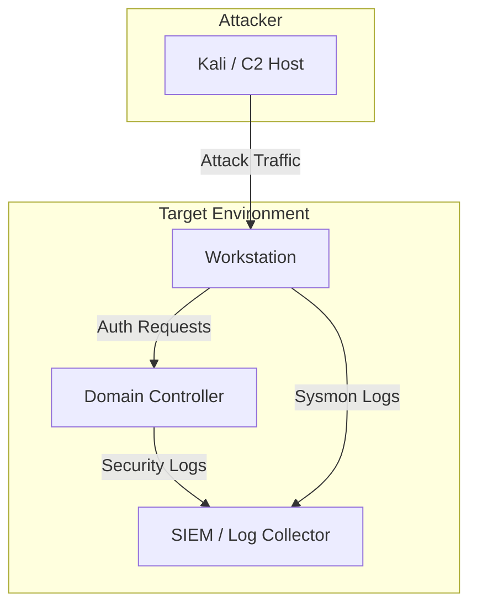

<!--
TEMPLATE: Lab Setup
Copy into domains/<domain>/labs/<lab-name>.md
Use for any reproducible attack-simulation or detection-testing lab environment.
-->

# Lab: <Lab Name>

| Field | Value |
|---|---|
| **Objective** | What technique(s)/scenario this lab reproduces |
| **Domain** | e.g. Active Directory |
| **Difficulty** | Beginner / Intermediate / Advanced |
| **Est. Build Time** | e.g. 45 min |
| **Cost** | Free / Est. cloud cost per hour |

## Objective

Describe the learning outcome — what will the reader be able to attack/detect after completing this lab.

## Architecture



## Tools Required

| Tool | Purpose | Link |
|---|---|---|
| e.g. Vagrant / Terraform | Environment provisioning | |
| e.g. Sysmon | Endpoint telemetry | |
| e.g. Splunk/ELK | Log aggregation | |

## Build Steps

> ⚠️ Isolated lab network only — never expose intentionally vulnerable hosts to the internet.

1. Provision infrastructure
   ```bash
   terraform init && terraform apply
   ```
2. Configure logging/telemetry forwarding
3. Deploy vulnerable configuration / seed data
4. Validate connectivity between attacker and target

## Attack Scenario Walkthrough

Reference the relevant TTP doc(s) in `../ttps/` and walk through executing them in this lab.

1. Step 1 — link to [technique doc](../ttps/example-technique.md)
2. Step 2
3. Validate detection fired as expected

## Validation Checklist

- [ ] Attack technique executed successfully
- [ ] Expected logs generated
- [ ] Detection rule triggered
- [ ] False positive rate checked

## Teardown

```bash
terraform destroy
```

- [ ] All cloud resources deprovisioned
- [ ] Snapshots/VMs removed
- [ ] Credentials/keys rotated or deleted

## Notes & Gotchas

Anything that tripped you up while building this lab, for the next person.
