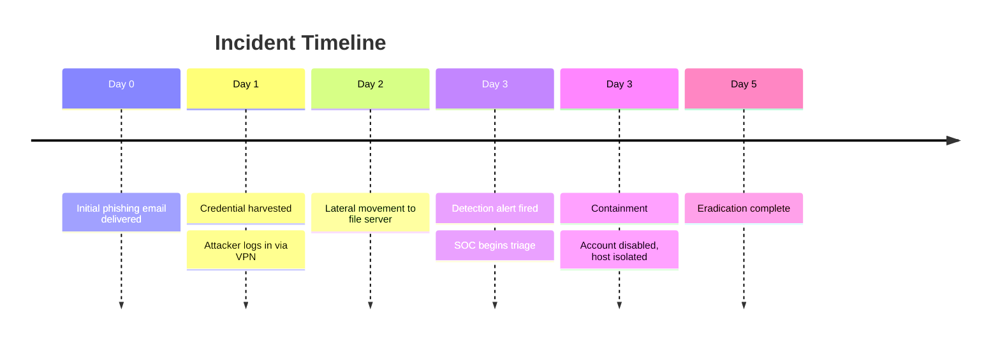
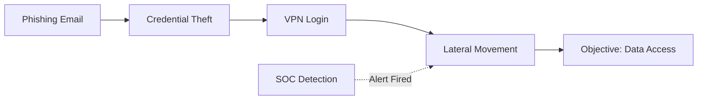

<!--
TEMPLATE: Lessons Learned / Post-Incident Review
Copy into domains/dfir/<incident-name>.md
Redact all sensitive identifiers (hostnames, IPs, usernames, customer names) before committing.
-->

# Lessons Learned — <Incident Name / ID>

| Field | Value |
|---|---|
| **Incident ID** | INC-XXXX |
| **Date Detected** | YYYY-MM-DD |
| **Date Contained** | YYYY-MM-DD |
| **Severity** | Low / Medium / High / Critical |
| **Domain(s) Affected** | e.g. Active Directory, AWS |
| **MITRE ATT&CK Techniques** | T1566, T1078 (link to [mapping](../../templates/mitre-mapping-template.md)) |
| **Report Author** | @your-handle |

## Executive Summary

2-3 sentence, non-technical summary of what happened and the impact.

## Timeline

| Time (UTC) | Event | Source |
|---|---|---|
| | | |

## Root Cause

What allowed this to happen — technical and/or process failure.

## Attack Path

## What Worked Well

- Detection/response steps that performed as expected

## What Didn't Work

- Gaps in visibility, process delays, tooling failures

## Action Items

| Action | Owner | Priority | Status |
|---|---|---|---|
| Add detection for T1078 abuse pattern | | High | Open |
| Enforce MFA on VPN | | High | Open |

## Related Detections / TTP Docs

- [Link to updated/new TTP doc](../../domains/)

## Appendix: IOCs (Redacted)

| Type | Value | Notes |
|---|---|---|
| Hash | `sha256:...` | |
| Domain | `example[.]com` | |
