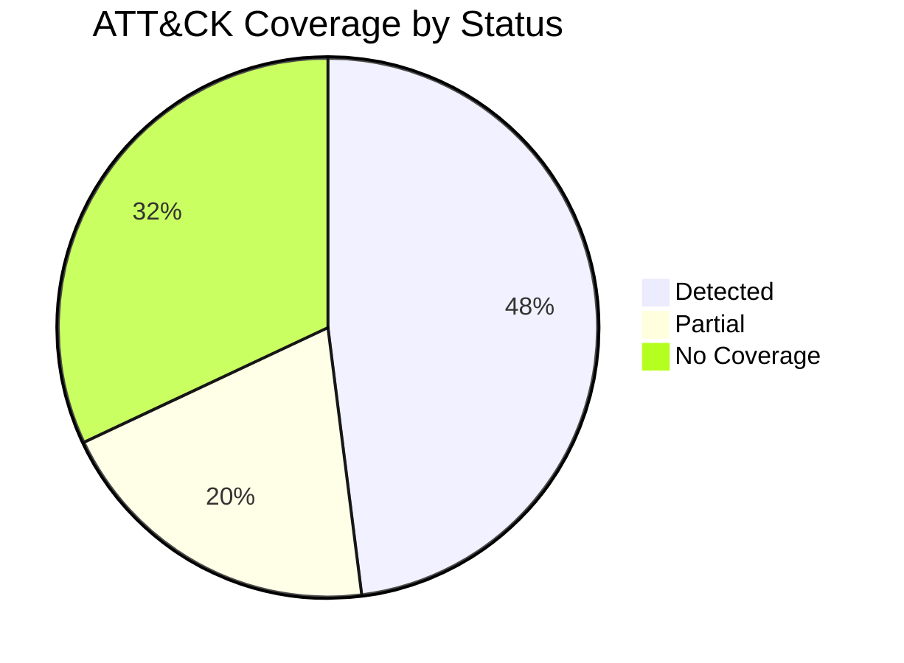

<!--
TEMPLATE: MITRE ATT&CK Mapping
Use this to track ATT&CK coverage for a domain, a campaign, or an incident.
Copy into domains/<domain>/README.md coverage section, or a standalone file for a specific engagement.
-->

# MITRE ATT&CK Mapping — <Domain / Campaign / Incident Name>

**Matrix:** Enterprise / Cloud / Mobile / ICS (choose one)
**Scope:** <e.g. Active Directory domain, AWS org, single incident>
**Last Updated:** YYYY-MM-DD

## Coverage Table

| Tactic | Technique ID | Technique Name | Sub-technique | Detection Coverage | Linked Doc |
|---|---|---|---|---|---|
| Initial Access | T1078 | Valid Accounts | T1078.002 (Domain Accounts) | 🟢 Detected | [link](../ttps/valid-accounts.md) |
| Credential Access | T1558 | Steal or Forge Kerberos Tickets | T1558.003 (Kerberoasting) | 🟡 Partial | [link](../ttps/kerberoasting.md) |
| Persistence | T1098 | Account Manipulation | — | 🔴 No Coverage | — |

**Legend:** 🟢 Detected & tested · 🟡 Partial / log-only · 🔴 No detection · ⚪ Not applicable to environment

## Coverage Summary by Tactic



## ATT&CK Navigator Export

To visualize this table in the official [ATT&CK Navigator](https://mitre-attack.github.io/attack-navigator/), export it as a Navigator layer JSON:

```json
{
  "name": "<Domain> Coverage",
  "versions": { "attack": "15", "navigator": "4.9.1", "layer": "4.5" },
  "domain": "enterprise-attack",
  "techniques": [
    { "techniqueID": "T1558.003", "score": 50, "comment": "Partial coverage — Sigma rule in place, not tuned" },
    { "techniqueID": "T1078.002", "score": 100, "comment": "Fully detected" }
  ],
  "gradient": { "colors": ["#ff6666", "#ffe766", "#8ccc66"], "minValue": 0, "maxValue": 100 }
}
```

## Gaps & Priorities

| Priority | Technique | Reason | Owner |
|---|---|---|---|
| High | T1098 Account Manipulation | No detection, high AD risk | TBD |
